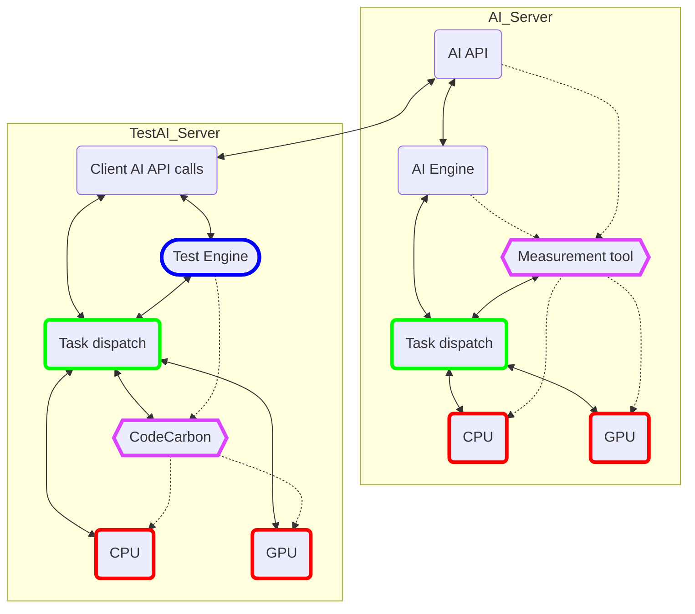
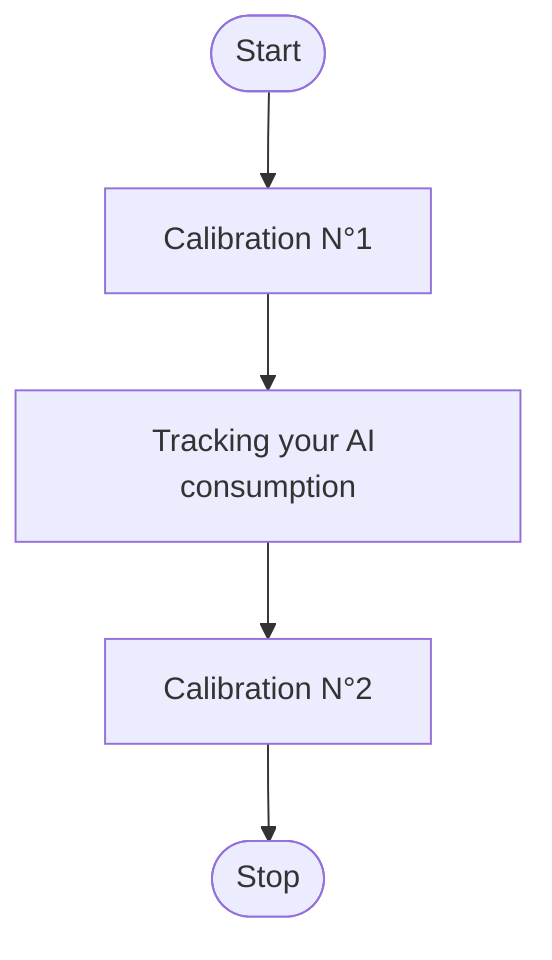

This energy report format is published under Creative Commons 4.0.
https://creativecommons.org/licenses/by/4.0/

# Reporting of the AI's energy consumption

## 1. Goal

The goal described by this document is to setup a simple and resilient digital ecosystem, so as to gather homogeneous, well-formated measures of energy consumption from an atomic software task in general and Machine Learning / Deep Learning / AI / GenAI tasks in particular.

The purpose thereby followed is to build a large, open, database of energy consumption of IT / AI tasks depending on data nature, algorithms, hardware, etc., in order to improve energy efficiency approaches based on empiric knowledge. 

More concretely, this empiric knowledge may be used in applied research to improve frugal approaches in AI models grid search and avoid energy-intensive tasks.

To unsure that this base is solid and useful, please read carefully the documentation so that everyone can take comparable measurements.

## 2. Who should participate ? 

People who runs machine learning models can contribute to this dataset. They just need to set up a measurement tool to be able to measure the energy consumption of their machine learning algorithms and our model will allows them to transform the energy consumption into very valuable data. 

## 3. Energy Measurement

It is assumed that the measurement of an atomic task can be achieved by one or several means among the following.

### Software-based 
CodeCarbon
Carbon AI
PyJoules
PowerGadget
...

### Hardware-based 
Direct physical measure with a Watt-meter.

## 4. Conditions
### Ideal measurement schema

The ideal condition is to measure the energy consumption of both the server where your AI is deployed and also from the client server that query the AI.
If the ideal case is not possible, prefer measurements on the AI side because we mainly want to measure the AI model's consumption and not your test tools or scripts. 

### Calibration

If possible, please make one (or more) calibration measurement and provide it on your report (there are appropriate fields to do it in the measure_schema.json). It allows to seperate the consumption of your machine that is related to your actual ml task from it initial consuption. This is especially necessary when the machine is already being used for another power-hungry task.

**Calibration capture:**

### Other ideals conditions
You will find below a description of the ideal conditions :

- A tool that is compatible with your components (CPU, GPU etc) to avoid as much as possible constant mode (when the energy consumption of your components has been calculated with a constant as a function of execution time).
- Have nothing else than the model launched on the machine to not disturb the measure (close all you other windows and apps), if you can't, reduce cross-functional activities to the minimum possible.
- Calibration : measure the consumption of your machine during few minutes before and after you launch your model to be aware of your initial consumption and fill it in your report.
- Take care to to fill in as many fields as possible in your report.

We know that this ideal conditions are not easy to assemble, so we let you provide a lot of different configurations but it is very important that you give us the maximum information about your condition of run and your methodology of measure.

## 5. Understand the data model

### Global structure

The report_schema.json is composed of few sub schemas : algorithm_schema.json, dataset_schema.json, hardware_schema.json, inference_schema.json & report_schema.json. 

The main sections in the report are : 
- header
- tasks
  - datasets
    - inferences
- measures
- system
- software
- infrastructure
- environment
- quality
- hash 

Most of these sections are mandatory but in each section, there are a lot of optionnal parameters to adapt to a wide variety of configurations. 

### Guidelines to create valuable report

The datamodel is complex and allows to describe a lot of different configurations : for example, you can provide provide the description of as many dataset or hardware components that you want. However, it is important to bear in mind that the more precise the report, the more usefull the information will be. For example, if you simply say that you performed 10000 inferences on different images of various sizes, using a supervised algorithm, that you were on the cloud and that you consumed x kWh, this will not allow you to deduce much information about the cost of an inference on a specific piece of data on a specific hardware. It is better to produce reports on a finer scale: I've run this recognition algorithm, I've measured the power consumption of the cpu and gpu of this model, I have made an inference about an image of this certain size...    

Read the schema carefully: some attributes are enumerations with detailed possible values, others are free fields. When this is the case, please describe things in a unique and unambiguous way to facilitate processing. We ask you to use the [camel_case](https://en.wikipedia.org/wiki/Camel_case) notation (e.g don't write "Random forest" or "Random_forest" but "randomForest" instead).

## 6. State-of-the-art 

To create this datamodel, we based ourselves on these references:

### On ML tasks categorization

- https://www.researchgate.net/publication/320609700_A_Review_on_Machine_Learning_Algorithms_Tasks_and_Applications
- https://vitalflux.com/7-common-machine-learning-tasks-related-methods/
- https://pythonprogramminglanguage.com/machine-learning-tasks/
- https://accessibleai.dev/post/coremltasks/
- https://www.c-sharpcorner.com/article/a-quick-overview-of-machine-learning-tasks/

### On ML description frameworks

These could typically inspire the ground for a format of reporting.
- https://hdsr.mitpress.mit.edu/pub/zkib7xth/release/2
- https://www.iso.org/standard/74438.html
- https://standards.ieee.org/ieee/3123/10744/

## 7. Schema json validator

The validate-schema.py script (in the folder 'tools>schema_validator') allows you to validate that the json you have created correctly follows the schema we have defined (in the folder 'model'). 

## 8. Automation of the report creation 

To make the use of this data model easier and more efficient, we want to develop a tool that automates the report creation. Initially, it would be a prototype overlaying CodeCarbon (started at the Boavizta hackathon of May in the folder 'tools>automated_report_creation'). To be continued

## 9. Open source dataset

The final objective is to create an open dataset (probably hosted on hugging face) so that anyone can share his consumption data about any task of ml with the whole community. It will help us to understand better what influences consumption and how we can better predict and manage it, in particular by extending tools such as ecologits. To be continued

## Let's GO 
Thanks for your attention and your intention to measure the consumption of AI. It is an essential step into better knowledge about the impacts of thoses models.