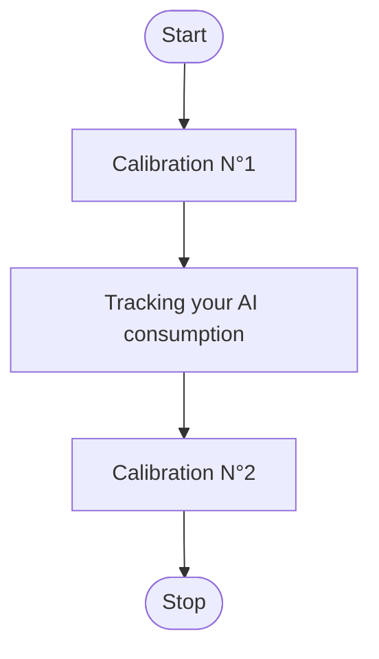

# Open Data about the environnemental impact of AI models : Sampling Kit

- [Open Data about the environnemental impact of AI models : Sampling Kit](#open-data-about-the-environnemental-impact-of-ai-models--sampling-kit)
  - [Goal](#goal)
  - [Who should participate ?](#who-should-participate-)
  - [Sampling conditions](#sampling-conditions)
    - [Sample xLM inference](#sample-xlm-inference)
      - [Test modelisation schema](#test-modelisation-schema)
      - [Ideal measurement schema](#ideal-measurement-schema)
      - [Measurement only on AI side schema](#measurement-only-on-ai-side-schema)
      - [Conclusion](#conclusion)
    - [The Ideal Conditions](#the-ideal-conditions)
  - [The datamodels](#the-datamodels)
    - [Part of the datamodel which is the same for every ML tasks](#part-of-the-datamodel-which-is-the-same-for-every-ml-tasks)
    - [Specific fields for classification \& regression tasks](#specific-fields-for-classification--regression-tasks)
    - [Specific fields for xLMs finetuning/ retraining](#specific-fields-for-xlms-finetuning-retraining)
    - [Specific fields for xLMs inference](#specific-fields-for-xlms-inference)
    - [Which csv/json should I fill ?](#which-csvjson-should-i-fill-)
  - [The energy consumption measurement](#the-energy-consumption-measurement)
    - [How to proceed with CodeCarbon ?](#how-to-proceed-with-codecarbon-)
    - [How to proceed with another tool ?](#how-to-proceed-with-another-tool-)
    - [To keep in mind :](#to-keep-in-mind-)
  - [Let's GO](#lets-go)

## Goal

The objective of this participative & open dataset is to create data on the environmental impact of AI. It will allows everyone to become aware on this subject and to better understand and control the impact of their AI. To unsure that this base is solid and useful, please read carefully the documentation so that everyone can take comparable measurements.

## Who should participate ?

People who runs machine learning models can contribute to this dataset. There are few cases :

- You are about to run an algorithm, you just need to add few lines of code to correctly locate trackers in order to measure the impact of the training and/or inference of your model. If you already have another performant measuring tool, you can provide both measures.
- You already ran an algorithm with a measuring tool but you have noted all the information needed to complete the dataset, you can provide this measure.

## Sampling conditions

Lets share basics to be sure

### Sample xLM inference

For instance your are about to test your xLM by injecting prompts (payload) with a Test engine via a client and receiving resulting text on the client :

#### Test modelisation schema

**Where is it needed to measure the consumption ?**

For that let's add the measurements with CodeCarbon :

#### Ideal measurement schema

If the ideal case is not possible, prefer measurements on the AI side because that is what we want to profile.

#### Measurement only on AI side schema

#### Conclusion

Always keep in mind that we mainly want to measure the AI model's consumption and not your test tools or scripts. Even if measuring the tools and scripts can provide interessting complementary informations.

- **Important** - : In the previous example, you can replace the **_testing of xLM_** by :

- _Training of xLM_
- _Retraining of xLM_
- _Finetuning of xLM_

and **_xLM_** by :

- _Classification_
- _Regression_

### The Ideal Conditions

You will find below a description of the ideal conditions :

- A CPU that accept a codecarbon capture in a non-constant mode.
- If you have GPU, nvidia GPU is ideal because it provides the NVML library which allows to monitor the electricty consumption of the GPU.
- Use the measuring tool [Codecarbon](https://codecarbon.io/#howitwork), it is a Python library so it also involve to use Python as a programming langage. Moreover there are few tracker modes in codecarbon, the best is to track the CPU use with RAPL and the GPU use with pynvml (avoid constant mode which is less precise !).
- Have a lighweight Linux distribution.
- Have nothing else than the model launched on the machine to not disturb the measure (close all you other windows and apps), if you can't, reduce cross-functional activities to the minimum possible.
- Calibration : measure the consumption of your machine during few minutes before and after you launch your model to be aware of your initial consumption and to be able to substract it from you measurements.
- Take care to get all the informations needed to have all the fields fullfilled.

Here is a diagramme to show you the methodology :

**Calibration :**

**Tracking the consumption of your model** :

**The whole test process :**

We know that this ideal conditions are not easy to assemble, so we let you provide a lot of different configurations but it is very important that you give us the maximum information about your condition of run and your methodology of measure.

## The datamodels

### Part of the datamodel which is the same for every ML tasks

Free text zone to describe as much as possible your experiment conditions : ................................................................................................................................................................................................

| Field                   | Type    | Mandatory Recommended Optional | Description                                                                                                                                                              | Example                        |
| ----------------------- | ------- | ------------------------------ | ------------------------------------------------------------------------------------------------------------------------------------------------------------------------ | ------------------------------ |
| machine_type            | String  | Recommended                    | Type of machine : physical, virtual, both, other...                                                                                                                      | Physical                       |
| model_CPU               | String  | Recommended                    | Name of the CPU's model                                                                                                                                                  | Intel Xeon Platinum 8272CL CPU |
| nb_CPU_cores            | Integer | Mandatory                      | Number of CPU cores                                                                                                                                                      | 16                             |
| model_GPU               | String  | Recommended                    | Name of the GPU's model                                                                                                                                                  | NVIDIA A100                    |
| nb_GPU_cores            | Integer | Recommended                    | Number of GPU cores                                                                                                                                                      | 80                             |
| GPU_memory              | Integer | Recommended                    | Size of each GPU core (GB)                                                                                                                                               | 4                              |
| RAM_size                | Float   | Mandatory                      | Size of the RAM (Go)                                                                                                                                                     | 14.0                           |
| OS_distribution         | String  | Recommended                    | Name of the OS distribution                                                                                                                                              | Ubuntu 22.04.3                 |
| programming_langage     | String  | Recommended                    | Name of the programming langage                                                                                                                                          | Python                         |
| runtime                 | Float   | Mandatory                      | Runtime of your algorithm (seconds)                                                                                                                                      | 154.86                         |
| server_side             | String  | Mandatory                      | What did you measure ? the AI_server side, the testingAI_server side, or both at the same time ?                                                                         | AI_server & testingAI_server   |
| measuring_tool          | String  | Mandatory                      | Name of the tool you used to measure the electricity consumption                                                                                                         | Codecarbon                     |
| CPU_tracking_mode       | String  | Recommended                    | If you used codecarbon, what mode was used to track the CPU consumption ? (constant, psutils, RAPL, Powergadget)                                                         | RAPL                           |
| GPU_tracking_mode       | String  | Recommended                    | If you used codecarbon, what mode was used to track the GPU consumption ? (constant or pynvml)                                                                           | pynvml                         |
| calibration_measure     | Float   | Recommended                    | Standard electricty consumption of the server before launching an algo (in kWh), if you callibrate before and after running you model, you can sum the values            | 0.000579136                    |
| calibration_time        | Float   | Recommended                    | Duration (in seconds) used for the callibration process, sum if you callibrate few times (recommended 2x120s)                                                            | 180                            |
| electricity_consumption | Float   | Mandatory                      | Electricity consumption (kWh) related to the run of your algorithm (only direct emissions of scope 2 no PUE here)                                                        | 0.002079136                    |
| measured_accuracy       | Float   | Optional                       | Accuracy of your model                                                                                                                                                   | 0.9142                         |
| estimated_accuracy      | String  | Optional                       | If you didn't measure the accuracy of your model in concrete percentages, you can give an assessment of the precision between: VERY POOR, POOR, AVERAGE, GOOD, VERY GOOD | GOOD                           |

### Specific fields for classification & regression tasks

| Field          | Type    | Mandatory Recommended Optional | Description                                      | Example        |
| -------------- | ------- | ------------------------------ | ------------------------------------------------ | -------------- |
| nb_features    | Integer | Mandatory                      | Number of features of the preprocessed dataset   | 10             |
| nb_lines       | Integer | Mandatory                      | Number of lines of the preprocessed dataset      | 20 000         |
| algorithm_type | String  | Mandatory                      | Type of algorithm (classification or regression) | classification |
| algorithm_name | String  | Mandatory                      | Name of the algorithm                            | Naive Bayes    |
| stage          | string  | Mandatory                      | Training or use (inference)                      | training       |

### Specific fields for xLMs finetuning/ retraining

| Field                          | Type   | Mandatory Recommended Optional | Description                                                                            | Example                                          |
| ------------------------------ | ------ | ------------------------------ | -------------------------------------------------------------------------------------- | ------------------------------------------------ |
| model_name                     | String | Mandatory                      | Name of the pretrained xLM                                                             | LLaMa                                            |
| nb_parameters                  | Number | Mandatory                      | Number of parameters of the pretrained xLM                                             | 7B                                               |
| finetuning_dataset_size_words  | Number | Mandatory                      | Size of the dataset used for finetuning (number of words)                              | 12 600                                           |
| finetuning_dataset_size_tokens | Number | Mandatory                      | Size of the dataset used for finetuning (number of tokens)                             | 10 000                                           |
| nb_epochs                      | Number | Recommended                    | Number of training epochs                                                              | 10                                               |
| batch_size                     | Number | Recommended                    | Size of the batch (number of samples that are trained in the network at the same time) | 32                                               |
| peft_name                      | String | Optional                       | Name of the Parameter-efficient fine-tuning method(s) used                             | QLora                                            |
| Free_text_zone_peft            | String | Optional                       | Other steps or informations that didn't fit with the fields like RHLF                  | We have use a RHLF method to reinforced learning |

### Specific fields for xLMs inference

Depending on the task of xLMs, you should fill specific fields :

- for chatbots : prompt_words, prompt_tokens, response_words, response_tokens, in_context_learning_words, in_context_learning_tokens, history_words, history_tokens
- for keywords extraction : input_text_words, input_text_tokens, nb_keywords
- for summarization : input_text_words, input_text_tokens, response_words, response_tokens
- for classification : nb_samples_to_classify, average_length_sample_words, average_length_sample_tokens, number_classes

| Field                        | Type   | Mandatory Recommended Optional | Description                              | Example |
| ---------------------------- | ------ | ------------------------------ | ---------------------------------------- | ------- |
| prompt_words                 | Number | Recommended                    | Number of words in the prompt            | 350     |
| prompt_tokens                | Number | Recommended                    | Number of tokens in the prompt           | 567     |
| response_words               | Number | Recommended                    | Number of words in the response          | 260     |
| response_tokens              | Number | Recommended                    | Number of tokens in the response         | 341     |
| in_context_learning_words    | Number | Recommended                    | Number of words in the provided context  | 1457    |
| in_context_learning_tokens   | Number | Recommended                    | Number of tokens in the provided context | 1700    |
| history_words                | Number | Recommended                    | Number of words in the history window    | 730     |
| history_tokens               | Number | Recommended                    | Number of tokens in the history window   | 900     |
| input_text_words             | Number | Recommended                    | Number of words in the initial text      | 1503    |
| input_text_tokens            | Number | Recommended                    | Number of tokens in the initial text     | 1503    |
| nb_keywords                  | Number | Recommended                    | Number of keywords extracted extracted   | 15      |
| nb_samples_to_classify       | Number | Recommended                    | Number of samples to classify            | 3000    |
| average_length_sample_words  | Number | Recommended                    | Average number of words in each sample   | 260     |
| average_length_sample_tokens | Number | Recommended                    | Average number of tokens in each sample  | 260     |
| number_classes               | Number | Recommended                    | Number of classes                        | 3       |

### Which csv/json should I fill ?

| Type of ML algorithm | stage                    | subtask             | Doc to fill (.csv or .json)            |
| -------------------- | ------------------------ | ------------------- | -------------------------------------- |
| classification       | training or inference    | X                   | classification_data                    |
| regression           | training or inference    | X                   | regression_data                        |
| xLM                  | finetuning or retraining | X                   | training_retraining_xLM_data           |
| xLM                  | inference                | chatbot             | inference_xLM_chatbot_data             |
| xLM                  | inference                | keywords extraction | inference_xLM_keywords_extraction_data |
| xLM                  | inference                | summarization       | inference_xLM_summarization_data       |
| xLM                  | inference                | classification      | inference_xLM_classification_data      |

## The energy consumption measurement

We want to profile the energy consumed during the run of a model (only scope 2). To do so, there are two types of tools : hardware power meters and software packages that tracks the electricty consumption of differents components of your computer, generally the RAM, CPU & GPU. We recommend you to use CodeCarbon because it is the most easiest tool to use and it allows very precise measures that allow to separe the cost related to the training and to the inference for example. However, we are also interested in any measurements made using other methods or tools.

### How to proceed with CodeCarbon ?

1. Choose a dataset and clean it (preprocessing stage)
2. Install CodeCarbon -> pip install codecarbon
3. Create the .codecarbon.config file that will allow you to define which logs to display during tracking and in which file to save the measurements taken. You can find an example here : « ./codecarbon.config » and the complete documentation [here](https://mlco2.github.io/codecarbon/usage.html#configuration).
4. Take inspiration from the "./codecarbon_tuto/tuto_measurements_with_codecarbon.ipynb" script to place your trackers at the right location in your code: remember to note the size of the database (number of rows and columns) used for training the model and then for its test phase (=use phase).
5. Retrieve the csv file created by codecarbon, where you will find all the information you need to complete the DB (execution time, energy consumption, type of CPU, number of cores, RAM size, etc).
6. Fill in the information requested in the database adapted to tour task.

### How to proceed with another tool ?

We need to use the most similar methodologies possible between all the differents runs and contibutors so that all the lines of the DB are comparable. Please take a look at the script "resources/codecarbon_tuto/tuto_measurements_with_codecarbon.ipynb" so that you see where the trackers are located and therefore, what you should measure with your own tool. For example, be aware that we don't measure the impact of the preprocessing.

### To keep in mind :

If your favorite tool is not Codecarbon, try to use it as well so we can compare the results. We want to measure specific elements that we describe above, it doesn't take into account the whole AI life cycle : be aware that we don't take it account the the cost of the data collection, data processing, deployment, terminal users...

## Let's GO

Thanks for your attention and your intention to measure the consumption of AI. It is an essential step into better knowledge about the impacts of thoses models. If you have any question, please send an email to 59597986.soprasteria.com@emea.teams.ms
